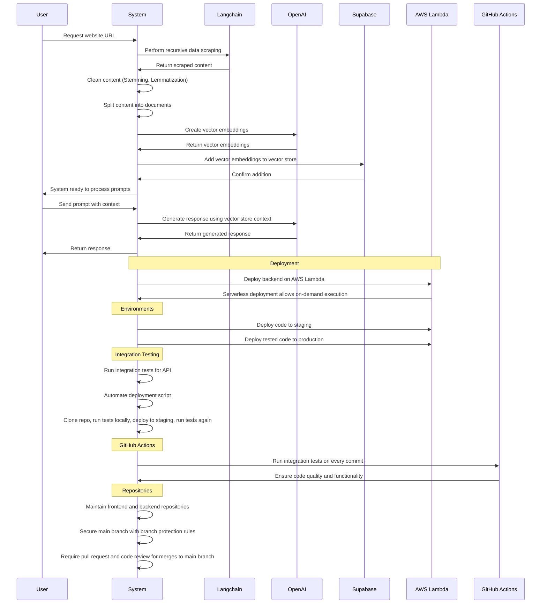

<div align="center">
<a href="">
    
</a>
</div>
</br>
<div>
<div align="center">


<br/>
<br/>

</div>

</div align="left" >

https://github.com/user-attachments/assets/c204dadd-e987-4574-ae91-5e45768282d4


## About SiteGenie

**SiteGenie** is an innovative AI chatbot meticulously designed to enhance website interactions. Trained on user-provided links, this advanced chatbot seamlessly integrates with websites, delivering instant responses and boosting user engagement. It expedites interactions by eliminating time-consuming searches, significantly improving operational efficiency.
</br>

## Features

- **Tailored Data Training:** Our chatbot receives specialized training from carefully selected web pages, nurturing a vast knowledge base for GPT model proficiency.
- **Enhanced Knowledge Base:** Ingest website content into a searchable knowledge base to ensure a robust reference source for chatbot training, enabling accurate and contextually relevant responses.
- **Instantaneous Responses:** The chatbot promptly addresses user queries regarding website content, eliminating the need for human intervention and significantly reducing user wait time.
- **Effortless Integration:** Easily embed the chatbot directly onto any website using HTML iframe embedding, with advanced customization options and theming to enrich user satisfaction and engagement.
- **Responsive and Efficient Design:** Implemented as an end-to-end solution that works on multiple screen sizes with the help of Tailwind CSS, enabling users to efficiently accomplish tasks without navigating multiple pages.
  </br>

_SiteGenie aims to deliver an intuitive and effective solution for crafting, personalizing, and launching AI-driven chatbots, ultimately elevating user engagement and satisfaction across various domains and industries._

<h1> Try SiteGenie</h1>

<!--`Link to install`
Screenshot of landing page
-->
## 💡 How SiteGenie works ?



>This sequence diagram depicts the interaction flow within a system handling website data processing and AI-driven response generation. Initially, the system scrapes data recursively from the requested URL, cleans it, and generates vector embeddings using OpenAI. These embeddings are stored in Supabase. Upon receiving prompts from users, the system leverages these stored embeddings to generate contextually relevant responses via OpenAI. Deployment on AWS Lambda allows for scalable serverless execution, with staging and production environments ensuring smooth integration through automated testing and GitHub Actions, maintaining code quality and security with stringent repository management practices like branch protection and code reviews for merges.

### Backend Repository - https://github.com/vedanti-u/SiteGenie-Backend
<!-- GETTING STARTED -->
## Contributing

### Built Over 

- Clone the repository

   ```sh
   git clone https://github.com/your_username_/Project-Name.git
   ```

- Install dependencies

   ```sh
   npm install
   ```

### Setting-up `.env` file

Your `.env` file should include

```sh
NEXT_PUBLIC_CLERK_PUBLISHABLE_KEY=<YOUR_CLERK_KEY>
CLERK_SECRET_KEY=<YOUR_CLERK_SECRET_KEY>
NEXT_PUBLIC_CLERK_SIGN_IN_URL=/sign-in
NEXT_PUBLIC_CLERK_SIGN_UP_URL=/sign-up
NEXT_PUBLIC_CLERK_AFTER_SIGN_IN_URL=/user-dashboard
NEXT_PUBLIC_CLERK_AFTER_SIGN_UP_URL=/user-dashboard
```

## 🤝 Contributing to Library

> [!NOTE]
> Contributing Guidelines

<details close>
  <summary>Create a pull request</summary>
  
  <h4>Fork this repository by clicking on the fork button on the top of this page. This will create a copy of this repository in your account.
  </h4>
</details>

<details close>
  <summary>Clone the repository
</summary>
  </br>
  
  

  <h4>Now clone the forked repository to your machine. Go to your GitHub account, open the forked repository, click on the code button and then click the _copy to clipboard_ icon, this is the COPIED_URL.</h4>

</br>
</br>
</br>
</br>
</br>

> _Open a terminal and run the following git command:_

```git
git clone "COPIED_URL"
```

e.g : `git clone https://github.com/vedanti-u/db.ai.git`
</br>

</details>

<details close>
  <summary> Install dependencies
</summary>

```bash
npm install
```

</details>

<details close>
  <summary> Create a branch
</summary>
Branch naming conviction
  Change to the repository directory on your computer (if you are not already there):

```bash
cd sitegenie
```

Now create a branch using the `git checkout` command:

```bash
git checkout -b new-branch-name
```

e.g : `git checkout -b llm-prompt-support`

**Name your branch according to the feature you are working on :**

e.g : you want to work on creating more llm prompt support, name your branch like `llm-prompt-support`

_(follow this naming convention i.e using "-" in between)_

</details>

<details>
  <summary>Setting up the .env</summary>

 Create a `.env` File with format

```bash
NEXT_PUBLIC_CLERK_PUBLISHABLE_KEY=<YOUR_CLERK_KEY>
CLERK_SECRET_KEY=<YOUR_CLERK_SECRET_KEY>
NEXT_PUBLIC_CLERK_SIGN_IN_URL=/sign-in
NEXT_PUBLIC_CLERK_SIGN_UP_URL=/sign-up
NEXT_PUBLIC_CLERK_AFTER_SIGN_IN_URL=/user-dashboard
NEXT_PUBLIC_CLERK_AFTER_SIGN_UP_URL=/user-dashboard
```

</details>

<details>
  <summary>Make contribution to Code</summary>
</details>

<details>
   <summary>Creating pull requests</summary>
  </br>
  Once you have modified an existing file or added a new file to the project of your choice, you can stage it to your local repository, which we can do with the `git add` command. In our example, `filename.md`, we will type the following command.

<code>$ git add filename.md</code>

where filename is the file you have modified or created

If you are looking to add all the files you have modified in a particular directory, you can stage them all with the following command:
`git add .`

Or, alternatively, you can type `git add -all` for all new files to be staged.

<h3>Commiting the changes</h3>
<code>git commit -m "Added a new prompt in prompts.json file"</code>

<h3>To PUSH your branch to your remote main</h3>
<code>$ git push --set-upstream origin your-branch-name</code>
</br>

e.g : `$ git push --set-upstream origin optimise-binding`

<h4>Open Github</h4>

click on compare & pull request
</br>
</br>
</br>
</br>

write a description for your pull request specifing the changes you have made, title it and then, Click on create pull request

_your branch will be merged on code review_

  </details>

</br>

<h3 id="colab"> :full_moon_with_face: Collaborators</h3>

<table>
  <tr>
    <td align="center">
      <a href="#">
          Vedanti Udapure
      </a>
    </td>
    <td align="center">
      <a href="#">
          Vedant Bhalerao
      </a>
    </td>
    <td align="center">
      <a href="#">
          Vojas Gonnade
      </a>
    </td>
  </tr>
</table>

-------

### :octocat: Statistics

[](https://github.com/ellerbrock/open-source-badges/)


[](https://github.com/Naereen/badges/)
[](https://GitHub.com/vedanti-u/SiteGenie/graphs/contributors/)
[](https://GitHub.com/Naereen/StrapDown.js/commit/)
[](https://GitHub.com/vedanti-u/SiteGenie/issues/)
[](https://GitHub.com/vedanti-u/SiteGenie/issues?q=is%3Aissue+is%3Aclosed)
[](https://GitHub.com/vedanti-u/SiteGenie/pulls?q=is%3Aclosed)
[](https://GitHub.com/vedanti-u/SiteGenie/pulls?q=is%3Aclosed)
[](https://GitHub.com/vedanti-u/SiteGenie/pulls?q=is%3Amerged)
[](https://github.com/vedanti-u/SiteGenie/blob/master/LICENSE)

![Love](https://img.shields.io/badge/Made_with_Love-pink?style=flat-square&logo=data:image/svg%2bxml;base64,PHN2ZyByb2xlPSJpbWciIHZpZXdCb3g9IjAgMCAyNCAyNCIgeG1sbnM9Imh0dHA6Ly93d3cudzMub3JnLzIwMDAvc3ZnIj48dGl0bGU+R2l0SHViIFNwb25zb3JzIGljb248L3RpdGxlPjxwYXRoIGQ9Ik0xNy42MjUgMS40OTljLTIuMzIgMC00LjM1NCAxLjIwMy01LjYyNSAzLjAzLTEuMjcxLTEuODI3LTMuMzA1LTMuMDMtNS42MjUtMy4wM0MzLjEyOSAxLjQ5OSAwIDQuMjUzIDAgOC4yNDljMCA0LjI3NSAzLjA2OCA3Ljg0NyA1LjgyOCAxMC4yMjdhMzMuMTQgMzMuMTQgMCAwIDAgNS42MTYgMy44NzZsLjAyOC4wMTcuMDA4LjAwMy0uMDAxLjAwM2MuMTYzLjA4NS4zNDIuMTI2LjUyMS4xMjUuMTc5LjAwMS4zNTgtLjA0MS41MjEtLjEyNWwtLjAwMS0uMDAzLjAwOC0uMDAzLjAyOC0uMDE3YTMzLjE0IDMzLjE0IDAgMCAwIDUuNjE2LTMuODc2QzIwLjkzMiAxNi4wOTYgMjQgMTIuNTI0IDI0IDguMjQ5YzAtMy45OTYtMy4xMjktNi43NS02LjM3NS02Ljc1em0tLjkxOSAxNS4yNzVhMzAuNzY2IDMwLjc2NiAwIDAgMS00LjcwMyAzLjMxNmwtLjAwNC0uMDAyLS4wMDQuMDAyYTMwLjk1NSAzMC45NTUgMCAwIDEtNC43MDMtMy4zMTZjLTIuNjc3LTIuMzA3LTUuMDQ3LTUuMjk4LTUuMDQ3LTguNTIzIDAtMi43NTQgMi4xMjEtNC41IDQuMTI1LTQuNSAyLjA2IDAgMy45MTQgMS40NzkgNC41NDQgMy42ODQuMTQzLjQ5NS41OTYuNzk3IDEuMDg2Ljc5Ni40OS4wMDEuOTQzLS4zMDIgMS4wODUtLjc5Ni42My0yLjIwNSAyLjQ4NC0zLjY4NCA0LjU0NC0zLjY4NCAyLjAwNCAwIDQuMTI1IDEuNzQ2IDQuMTI1IDQuNSAwIDMuMjI1LTIuMzcgNi4yMTYtNS4wNDggOC41MjN6Ii8+PC9zdmc+)
