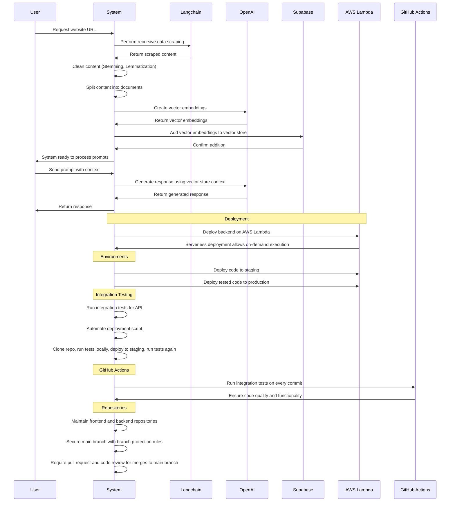

 

 
 

## About SiteGenie

**SiteGenie** is an innovative AI chatbot meticulously designed to enhance website interactions. Trained on user-provided links, this advanced chatbot seamlessly integrates with websites, delivering instant responses and boosting user engagement. It expedites interactions by eliminating time-consuming searches, significantly improving operational efficiency.
 

## Features

- **Tailored Data Training:** Our chatbot receives specialized training from carefully selected web pages, nurturing a vast knowledge base for GPT model proficiency.
- **Enhanced Knowledge Base:** Ingest website content into a searchable knowledge base to ensure a robust reference source for chatbot training, enabling accurate and contextually relevant responses.
- **Instantaneous Responses:** The chatbot promptly addresses user queries regarding website content, eliminating the need for human intervention and significantly reducing user wait time.
- **Effortless Integration:** Easily embed the chatbot directly onto any website using HTML iframe embedding, with advanced customization options and theming to enrich user satisfaction and engagement.
- **Responsive and Efficient Design:** Implemented as an end-to-end solution that works on multiple screen sizes with the help of Tailwind CSS, enabling users to efficiently accomplish tasks without navigating multiple pages.
   

> SiteGenie aims to deliver an intuitive and effective solution for crafting, personalizing, and launching AI-driven chatbots, ultimately elevating user engagement and satisfaction across various domains and industries.

<h1> Try SiteGenie</h1>

`Link to install`
Screenshot of landing page

## 💡 How SiteGenie works ?

